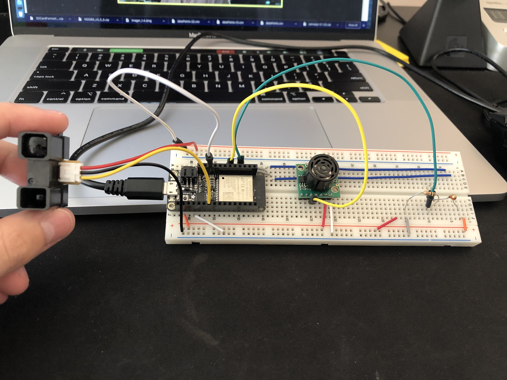
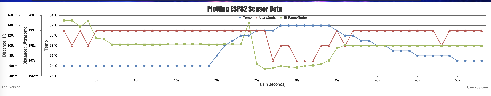

# Quest 2: Tactile Internet (sensors)

Authors: Brian Macomber, Ritam Das, Raghurama Bukkarayasamudram

## Date: 2020-10-08

## Summary

We wired three different sensors to the ESP32: a thermistor, an ultrasonic sensor, and an IR rangefinder. Using separate ADC (analog-to-digital converter) channels, the ESP32 was able to read the voltage. This voltage reading was converted to the appropriate engineering units for each sensor. These readings were written to the serial port and saved into a CSV file. We created a localhost endpoint, where the latest readings from the CSV file were converted to JSON and plotted using canvasjs and nodejs.

## Self-Assessment

### Objective Criteria

| Objective Criterion         | Rating | Max Value |
| --------------------------- | :----: | :-------: |
| Reading from Thermistor     |   1    |     1     |
| Reading from IR Rangefinder |   1    |     1     |
| Reading from Ultrasonic     |   1    |     1     |
| Graph Sensor data           |   1    |     1     |

### Qualitative Criteria

| Qualitative Criterion                          | Rating | Max Value |
| ---------------------------------------------- | :----: | :-------: |
| Quality of solution                            |   5    |     5     |
| Quality of report.md including use of graphics |   3    |     3     |
| Quality of code reporting                      |   3    |     3     |
| Quality of video presentation                  |   3    |     3     |

## Solution Design

### Wiring

The thermistor was wired through a voltage divider with a 10kohm resistor to step down the voltage from the 3.3V vcc. The ultrasonic and IR rangefinder sensors were wired directly to 3.3V and 5V and outputs were sent to adc pins.

        //thermistor monitor adc
        static const adc_channel_t channel2 = ADC_CHANNEL_4; //GPIO32
        //ultrasonic monitor adc
        static const adc_channel_t channel3 = ADC_CHANNEL_5; //GPIO33
        //rangefinder monitor adc
        static const adc_channel_t channel4 = ADC_CHANNEL_6; //GPIO34

### Sensor Code

We defined four functions: one for each sensor and a display_console function to call each sensor function and display the latest readings in an easy to read format.

In the thermistor function, we solved for the thermistor resistance using the voltage divider formula and plugging in our respective values. We then solved for the temperature using the previously calculated values from voltage and resistance. Lastly, the tempKelvin was converted to Celsius for final output.

In the ultrasonic function, we first convert the raw input to a voltage, then using the conversion from the LV-MaxSonor datasheet (~6.4mV/in),
we converted that voltage into a distance. From there we converted this distance to centimeters for the final output.

In the IR rangefinder function, we converted the voltage to distance in cm using a formula generated from linear fitting data taken from an IR sensor. The IR rangefinder had a functional range of 20cm to 150cm, so we capped it on either side using that range.

The display_console function called each sensor function and printed outputs in CSV format.

### Node.js & Canvas.js

In the data_to_csv.js file, we open the serial port and parse the data every time the esp32 sends the formatted data from the sensor function. Each time the data is read it is written to a line in the test_data csv file. Then we created an endpoint at http://localhost:8080/ where the index.html file is rendered. We created another endpoint at http://localhost:8080/data in the form of a http GET request, and the user will recieve all of the sensor data from the csv file in the form of JSON.

In the index.html file, we used Canvas.js to graph the sensor data. To get the data from the csv file, we query the data from the local /data endpoint. To auto update the graph as the csv file gets new data, the entire chart being rendered along with the query for the data is designed as a function that is called every 2 seconds using the setInterval method. Within the chart object, the axes, labels, and legend are all added to make the graph easier to understand.

### Investigative Question

Upon reading the spec sheets and testing the Ultrasonic sensor and the IR Rangefinder, we believe that the ultrasonic sensor would be more effective, considering it has a larger effective range. The IR rangefinder has an effective distance range of 20cm to 150cm, while the ultrasonic sensor has an effective distance range of 15cm to almost 600cm. We think that accuracy of distance is more important than how fast the data can be sampled since a remote control car will not be moving very fast and the sensors should have enought time to sample correct data.

## Video demo

## Sketches and Photos

  

 

## Supporting Artifacts

- https://github.com/BU-EC444/Team3-Bukkarayasamudram-Das-Macomber/tree/master/quest-2

- [Link to video demo](). Not to exceed 120s

## References

https://docs.espressif.com/projects/esp-idf/en/latest/esp32/api-reference/peripherals/adc.html

https://canvasjs.com/javascript-charts/

https://www.w3schools.com/nodejs/default.asp

---
