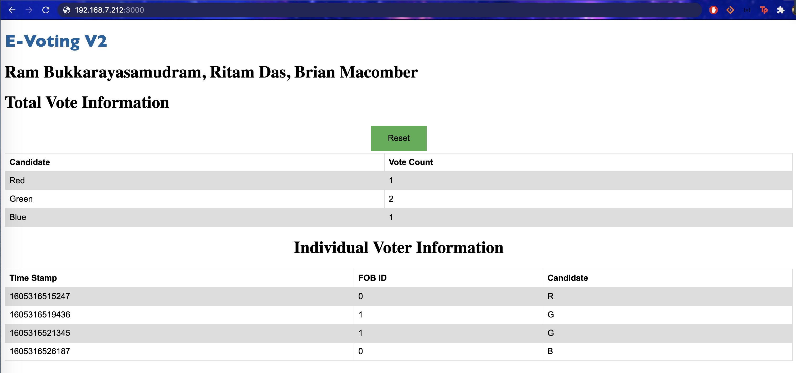

# Quest 4: E-Voting V2

Authors: Raghurama Bukkarayasamudram, Ritam Das, Brian Macomber

## Date: 2020-11-13

## Summary

Quest 4 required us to create multiple voting fobs using ESP32's that would communicate with each other via TX/RX communication and UDP. The voting fobs communicate with a leader fob through UDP. The leader collects fob ID's and their respective votes and sends it over UDP to the node server's socket. This information gets inserted into a levelDB along with the key as the time stamp. The node server hosts the web client, which renders an html file to visualize the database and keep a running count of RGB votes. (Reference Diagram Below)

#### NOTE

We did not finish the front end part of this quest. Data is successfully recieved by the web page and it displays an incorrect count of the votes. In addition, the button to reset the vote is not functional, as well as the list of all entries in the database.

## Self-Assessment

### Objective Criteria

| Objective Criterion               | Rating | Max Value |
| --------------------------------- | :----: | :-------: |
| Fob performs IR NFC Data Exchange |   1    |     1     |
| Receiving Fob Comm. to Leader     |   1    |     1     |
| Poll Leader Replacement           |   1    |     1     |
| Leader Reports to DB              |   1    |     1     |
| Portal Allows Query to DB         |   1    |     1     |
| Operates Over Multiple Sites      |   1    |     1     |
| Investigative Question            |   1    |     1     |

### Qualitative Criteria

| Qualitative Criterion                          | Rating | Max Value |
| ---------------------------------------------- | :----: | :-------: |
| Quality of solution                            |   4    |     5     |
| Quality of report.md including use of graphics |   3    |     3     |
| Quality of code reporting                      |   3    |     3     |
| Quality of video presentation                  |   3    |     3     |

## Solution Design

### Hardware & Embedded C

The FOB has IR TX/RX to communicate votes privately from one ESP to another. If any ESP recieves a vote (candiate and voter ID) through IR, it will communicate that vote to the poll leader who will forward it to the node server. If the poll leader recieves or wants to send an IR vote, it will send directly to the node server.

Each fob has the same .c code running on it with the excpetion of the ID being different for each one. Each ESP will connect to wifi and attempt to communicate through UDP with other ESPs on the system. This will cause a leader election, where the ESP with the lowest ID number will prevail as the leader. Every 30 seconds if it does not recieve a "Heartbeat" from the leader, a follower ESP will go into the election state to declare a new leader among the ESPs that are still comunicating. For a follower ESP, it sends out a signal to the others in the system every 6 seconds to let them know that they are a "follower" to a "leadder" that exists and has a heartbeat. The Leader esp will connect as client to the Nodejs server that handles the database.

### Node.js & Web Client

The server.js file creates the web client and reads in a time stamp, fob id, and vote from the ESP32 through UDP socket. The server creates a DB and puts this info into the DB in json format.

` db - Key : Value`
`{ time: [ date.now() ], fobID: [1], vote: [R] }`

### Front End

The data is queried and a message is emitted to the frontend. The frontend consists of an index.html file that displays these database queries in tabular format. Socket.io was used to send data from the fobs to the web client. The web client also contains a reset button that wipes the DB clean and allows for a new election.
The actual web client is being hosted on a local machine accessed through the server port. It refreshes every couple of seconds with the updated data or votes that are being sent in from the backend. When you press the reset button, it will send a message from the frontend to the backend using io.emit from the socket.io tool to delete the data being stored in the database.

#### Investigative Question: List 5 different ways that you can hack the system (including influencing the vote outcome or preventing votes via denial of service). Explain how you would mitigate these issues in your system.

There are three main areas of our system that present vulnerabilities: the receiver/transmitter communication, the UDP socket communication, and the web client.

Anyone can create their own receiver/transmitter and cast a false vote and send it to the poll leader. This is the security threat we face when using RX/TX communication. This risk could be mitigated by having the leader confirm the identity of the transmitter it receives votes from, thus only authorized users may cast a vote.

The communication between the ESP32 and the node server uses UDP, which also presents a security vulnerability. This no acknowledgement protocol is highly susceptible to spoofing and DOS attacks. Thus, anyone can send large volumes of packets to the server, potentially preventing allowing authorized users to cast votes or view data. To mititgate this, a section of code in server.js could be implemented such that all incoming packets to the server are monitored and limited at a certain threshold (packets per second, etc.), temporarily denying further incoming packets until below the threshold again.

UDP communication is also vulnerable to packet sniffing. An unauthorized user could intercept packets that are sent over UDP from the ESP32 to the node server and decipher the data within those packets (Wireshark). A potential solution to this is to use TCP communication, which is a safer handshaking protocol. TCP first confirms that the recipient is valid for data transmission and sends data following this acknowledgement. However, TCP would increase latency when communicating to the node server as UDP is a much faster protocol with a security tradeoff.

An unauthorized user also has the potential to log into the Pi directly and read into the database and server code. This could result in tampered data and unauthorized admin access. To prevent this, the wireless network the Pi is connected to should be setup for the WPA2 security mode, which is a much stronger security mode than WEP (currently being used & can be brute forced easily).

An unauthorized user could even steal the microSD card on the Pi and decode the information on there through another computer. We could mitigate the risk here by encrypting the microSD to add an extra layer of security and lock the information held on the SD card in the case it is stolen,

## Sketches and Photos

#### Web Client

In a perfect world, this is what the front end would look like if the functionality was 100%.

 

## Supporting Artifacts

#### Quest 4 Team Presentation

- .

#### Quest 4 Demo

- .

## Modules, Tools, Source Used Including Attribution

- Node & LevelDB: for our server file and creating database to hold values and query from
- Linereader: used to parse through data
- Socket.io: for receiving and sending queries from backend to frontend on the client
- esp-idf: starter code for many basic skills in this quest:
  - WiFi
  - IR TX/RX communication
  - Timer
  - Button hardware Interrupt
  - RTOS tasks

## References

- Node & LevelDB: https://www.npmjs.com/package/node-leveldb
- Level: https://github.com/google/leveldb/blob/master/doc/index.md
- HTML Button: https://www.w3schools.com/tags/tryit.asp?filename=tryhtml_button_css
- Socket.io: https://socket.io/docs/v3/client-api/index.html
- esp-idf: https://github.com/espressif/esp-idf

---
